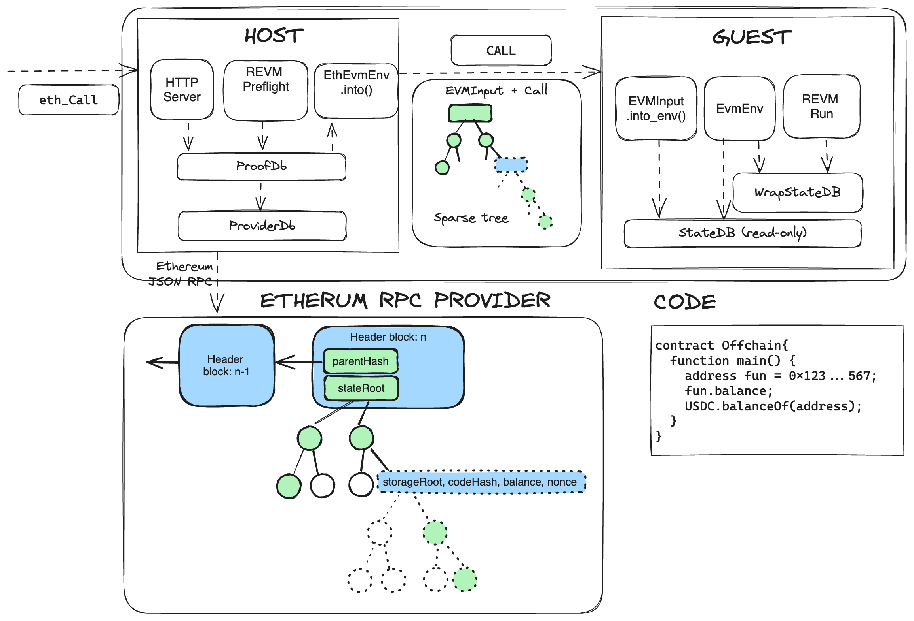
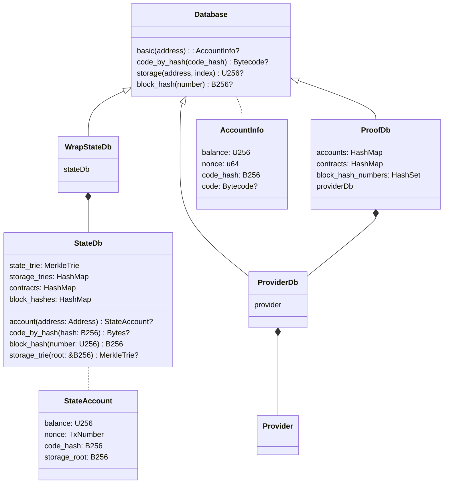
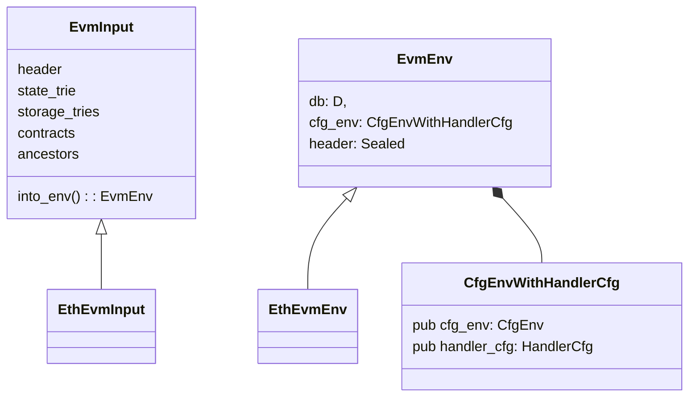
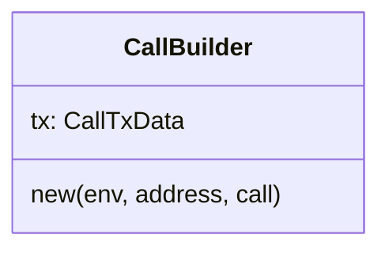

# vlayer

## Contributing

### Prerequisites

You will need to install following software to start working with repository:

- [Rust](https://www.rust-lang.org/tools/install) compiler
- Rust risc-0 [toolchain](https://dev.risczero.com/api/zkvm/quickstart)

### Building

To build project navigate to `rust` directory and type:

```sh
cargo build
```

## Architecture

Vlayer allows you to run EVM smart contracts off-chain and use results of their execution on-chain. Off-chain smart contracts have extra capabilities, like access to historical state of many chains, user emails and web data.

## Off-chain smart contracts

By convention off-chain smart contracts have the `.v.sol` extension.

## Examples

You can find and run examples from `examples` directory.

To run an example - go to specific example directory (e.g. `example/simple`) and run:

```sh
../../bash/vlayer-build.sh
```

## Architecture

On the high level, vlayer runs zkEVM that produces proof of proper execution. Under the hood, vlayer is written in Rust that is compiled to zero knowledge proofs. Currently, Rust is compiled with [RISC Zero](https://www.risczero.com/), but we aim to build vendor-lock free solutions working on multiple zk stacks, like [sp-1](https://github.com/succinctlabs/sp1) or [Jolt](https://github.com/a16z/jolt). Inside rust [revm](https://github.com/bluealloy/revm) is executed.

Our architecture is inspired by RISC Zero [steel](https://github.com/risc0/risc0-ethereum/tree/main/steel), with 3 main components, that can be found in `rust/` subdirectories:

- host - (in `host`) - Collects all data required by guest and runs guest execution and proving
- guest - (in `guest_wrapper/guest`) - Contains the code to be run inside zkvm
- guest-wrapper - (in `guest_wrapper`) - Compiles guest to [RISC Zero](https://doc.rust-lang.org/rustc/platform-support/riscv32im-risc0-zkvm-elf.html) target and makes it available to be run inside host

Host passes arguments to guest via standard input like functionality and similarly guests returns values by standard output like functionality.

In ZK terms, all inputs are **private** and all outputs are **public**. If you need public inputs - copy them to the output.

### Steel

When executing Solidity code in guest - it needs access to ethereum state and storage, which includes: balances, contracts code and smart contract variables.

**Note:** In off-chain execution the notion of the current block doesn't exist, hence we always access Ethereum at specific historical block. The block number can be the latest mined block available on the network. This is different than the current block inside on-chain execution, which can access the state at the moment of execution of the given transaction.

As zkvm works in isolation, every access to state needs to be proven.

To deliver all necessary proofs, following steps are performed:

- In preflight, we execute Solidity code on the host. Each time the db is called the value is fetched via Ethereum JSON RPC. Then, the proof is stored in the local database called ProofDb.
- Serialized content of ProofDb is passed via stdin to guest.
- Guest deserializes content into a local database StateDb.
- Solidity code is executed inside revm using local copy of StateDb.

Note that solidity execution is deterministic, hence database in the guest has exactly the data it requires.



#### Databases

We have two different databases run in two different places. Each is a composite database:

- **host** - runs ProofDb, which proxies queries to ProviderDb. In turn, ProviderDb forwards the call to Ethereum RPC provider. Finally, ProofDb stores information about what proofs will need to be generated for the guest.
- **guest** - runs WrapStateDb, which proxies calls to StateDb. StateDb consists of state passed from the host and has only the content required to be used by deterministic execution of solidity code in guest. WrapStateDb is an [adapter](https://en.wikipedia.org/wiki/Adapter_pattern) for StateDb that implements Database trait.



#### Environments

The environment in which execution will happen is stored in the generic type `EvmEnv<D, H>`, where `D` is a connected database and `H` represents the type of block header.

##### Block header

The block header type might vary on different sidechains and L2s. Currently, `EthBlockHeader` implemented by Steel is used. Whether we can reuse the type from Reth instead is an open question.

##### Life cycle

The environment is created in the host and converted into `EvmInput`, which is easy to serialize. Serialized data is then sent over standard input to the guest and deserialized in the guest.
`EthEvmInput` is an `EvmInput` specialized by `EthBlockHeader`.



### Contract calls



#### Notes on future development

To support multichain, we will need to introduce a new structure in place of `EthEvmEnv` and `EthEvmInput`. Each will contain multiple fields: `EvmInput` and `EvmEnv`, each with appropriate generic parameters, such as block type.

To support calls from multiple different blocks, we will need to introduce one more layer in between, which will store sub-environments for various blocks. This will introduce significant complexity.
