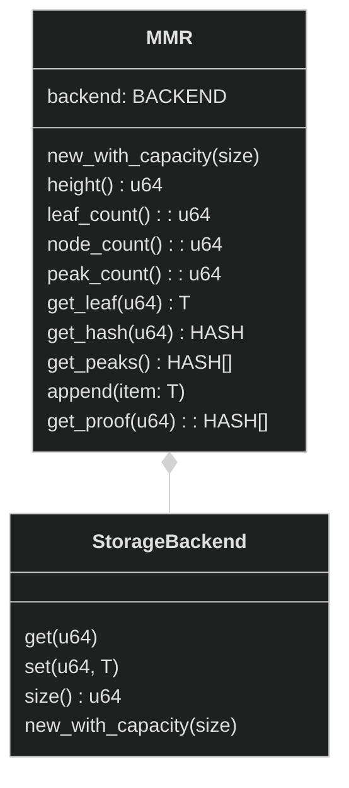
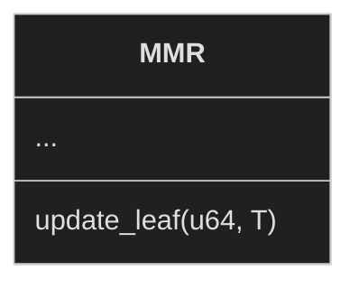
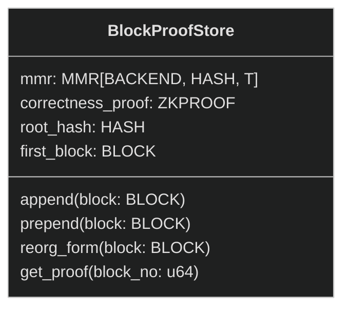

# Block proof cache

## Block inclusion proofs primer

### Storage proofs
A storage proof proves that a piece of chain state (account or smart contract variable) belongs to a certain block. To ensure that a piece of state belongs to a certain chain, it is not enough to prove that it belongs to a block. We must also prove that the block itself belongs to a chain.

### Recent and historical blocks
One way to prove that a block of a certain hash belongs to a chain is to run the Solidity `blockhash(uint)` function. It returns the hash of a block for a given number.
To perform a check, we need to hash a block with a certain state root and compare it with the result of the function.

However, this method is limited, as it only works for most recent 256 blocks on a given chain.
Therefore, we need another way to prove inclusion of older blocks in a chain.

We use the following naming in this document:
- *recent blocks* - any of the most recent 256 blocks (relative to current block_no)
- *historical blocks* - blocks older than 256

### Naive block inclusion proofs
To prove inclusion of certain *historical blocks* in a chain, we will prove that:
1. Some *recent block* belong to a chain
2. Both *historical block* and *recent block* belong to the same chain

A naive way to prove the inclusion proof of two blocks in the same chain is to hash all subsequent blocks from *historical block* to *recent block* and verify that each blockhash is equal to the *prevHash* value of the subsequent block.

See diagram below for visual.


Unfortunately, this is a slow process, especially if the blocks are far away form each other on the time scale. Fortunately, there is a way to cache all proofs in advance. For this purpose, vlayer uses the Block Proof Cache.

## Block Proof Cache

A Block Proof Cache is a distinct type of vlayer node, specifically a JSON RPC server. It consists mainly  of a single call `v_getBlockProofs(block_no: int[])`. This call takes one argument: an array of block numbers for the requested proofs. It returns a triplet: an array of Merkle proofs for each requested block, the root hash of the MMR structure, and π - a zk-proof of the correctness of the constructed MMR.

An example call could look like this:
```json
{
    "method": "v_getBlockProofs",
    "params": [
        [1231, 123123123, 312312]
    ]
}
```

And the response:
```json
{
    "result": [
        [
            [...],
            [...],
            [...]
        ],
        "0xe32ddb9c538f04c994e2e802237fa5f4c4e7e2643ab48bd8535b1c7009c8aa81",
        "0x9c538f04c994e2e802237fa5f4c4e7e2643ab48bd8535b1c7009c8aa81e32ddb"
    ]
}
```

### Merkle Mountain Range (MMR)

Under the hood, the Block Proof Cache uses a data structure called the Merkle Mountain Range (MMR). This structure is similar to Merkle Trees, with additional properties that make it very suitable for caching block proofs.

See en example Merkle Mountain Range below.


The MMR above has 19 nodes, 11 leaves and 3 peaks. The height is 4.

See the interface of an example MMR:


MMR has following generic parameters:
- T - type of data stored in the leaf
- HASH - type of data stored in non-leaf nodes
- BACKEND - used for storing MMR nodes. It has array like linear structure. Various implementations can store values on different mediums (e.g. memory for tests, hard drive for production).


Additionally, we extend classical MMR with `update` method:




## Block Proof Cache

`BlockProofStore` is built on top od MMR. 

On top of generic parameters of MMR, BlockProofStore also introduce two new types:
- ZKPROOF - recursive or composable zk proof
- BLOCK - block type associated with given chain (e.g. mainnet, optimism, etc)


