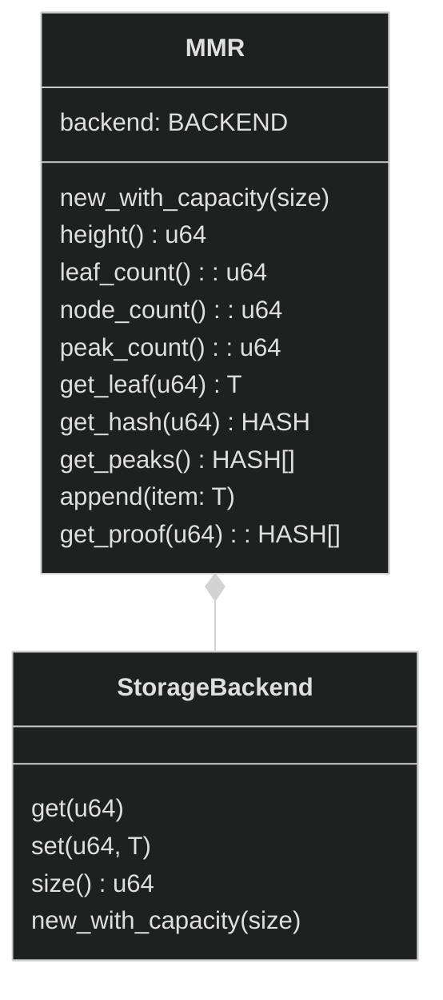

# Block proof cache

The Vlayer infrastructure enables the creation of proofs to verify facts about the state of Ethereum and layer 2 chains. To understand how this system works under the hood, it is essential to get familiar with the concepts of block proofs, storage proofs and understand the difference between recent and historical blocks.

## Block inclusion proofs primer

### Block and Storage proofs

A <b>block proof</b> verifies that a particular block belongs to a specific blockchain, ensuring the block's authenticity and its place in the chain. A <b>storage proof</b>, on the other hand, specifically verifies that a piece of data, such as an account balance or a smart contract variable, is stored within a particular state in a specific block.

To ensure that a piece of state belongs to a certain chain, it is essential to provide both types of proofs. A storage proof demonstrates that the data is part of a specific block, while a block proof confirms that this block is indeed a legitimate part of the blockchain.

### Recent and historical blocks

One way to prove that a block of a certain hash belongs to a chain is to run the Solidity `blockhash(uint)` function. It returns the hash of a block for a given number.
To perform a check, we need to hash a block with a certain state root and compare it with the result of the function.

However, this method is limited, as it only works for most recent 256 blocks on a given chain.
Therefore, we need another way to prove inclusion of older blocks in the chain.

We use the following naming in this document:

- _recent blocks_ - any of the most recent 256 blocks (relative to the current `block_no`)
- _historical blocks_ - blocks older than 256

### Naive block inclusion proofs

To prove inclusion of certain _historical blocks_ in a chain, we will prove that:

1. Some _recent block_ belong to the chain
2. Both _historical block_ and _recent block_ belong to the same chain

A naive way to prove the inclusion proof of two blocks in the same chain is to hash all subsequent blocks from _historical block_ to _recent block_ and verify that each blockhash is equal to the _prevHash_ value of the subsequent block.

See the diagram below for the visual.


Unfortunately, this is a slow process, especially if the blocks are far away from each other on the time scale. Fortunately, there is a way to cache all proofs in advance. For this purpose, vlayer uses the Block Proof Cache.

## Block Proof Cache

Block Proof Cache store block_number, blockhash> pairs for historical blocks. Block Proof Cache are implemented using Merkle Patricia trie, where block numbers are the keys and blockhashes are stored values. Why do we use Merkle Patricia Trie for storing blockhashes? It allows us to quickly generate block proofs that certain block is indeed a part of the given blockchain.

Following functions provide more details of Block Proof Cache implementation.

### Implementation

#### Initialize

The initialize function is used to create Block Proof Cache as a Merkle Patricia Trie and insert the initial block's hash into it. It calculates the hash of the block using the keccak256 function on the RLP-encoded block. Then it inserts this hash into the MPT at the position corresponding to the block number.

```rs
fn initialize(elf_id: Hash, block: Block) -> (MptRoot, elf_id) {
    let block_hash = keccak256(rlp(block));
    let mpt = new SparseMpt();
    mpt.insert(block.number, block_hash);
    (mpt.root, elf_id)
}
```

#### Append

The append function is used to add a new block to the Merkle Patricia Trie. It takes the following arguments:
- <b>elf_id</b>: a guest binary.
- <b>block</b>: the block header to be added.
- <b>mpt</b>: a sparse MPT containing two paths: one from the root to the parent block and one from the root to the node where the new block will be inserted.
- <b>proof</b>: a zero-knowledge proof (zk-proof) that verifies the correctness of the MPT so far.
  The function ensures that the new block correctly follows the previous block by checking the parent block's hash. If everything is correct, it inserts the new block's hash into the trie.

```rs
fn append(elf_id: Hash, block: BlockHeader, mpt: SparseMpt<ParentBlockIdx, NewBlockIdx?>, proof: ZkProof) -> (MptRoot, elf_id) {
    risc0_std::verify_zk_proof(proof, mpt.root, elf_id);
    let parent_block_idx = block.number - 1;
    let parent_block_hash = mpt.get(parent_block_idx);
    assert_eq(parent_block_hash, block.parent_hash, "Block hash mismatch");
    let block_hash = keccak256(rlp(block));
    let new_mpt = mpt.insert(block.number, block_hash);
    (new_mpt.root, elf_id)
}
```

#### Prepend

The prepend function is used to add a new oldest block to the Merkle Patricia Trie (MPT). It takes the following arguments:
* <b>elf_id</b>: a guest binary.
* <b>child_block</b>: the full data of the currently oldest block already stored in the MPT.
* <b>mpt</b>: a sparse MPT containing the path from the root to the child block and the new block's intended position.
* <b>proof</b>: a zero-knowledge proof (zk-proof) that verifies the correctness of the MPT so far.
The function verifies the proof to ensure the full data from the child block fits the MPT we have so far. If the verification succeeds, it takes the parent_hash from the currently oldest block and inserts it with the corresponding number into the MPT.
```rs
fn prepend(elf_id: Hash, child_block: BlockHeader, mpt: SparseMpt<ChildBlockIdx, NewBlockIdx>, proof: ZkProof) -> (MptRoot, elf_id) {
    risc0_std::verify_zk_proof(proof, mpt.root, elf_id);
    let child_block_hash = mpt.get(child_block.number);
    assert_eq(child_block_hash, keccak256(rlp(child_block)), "Block hash mismatch");
    let new_mpt = mpt.insert(child_block.number - 1, child_block.parent_hash);
    (new_mpt.root, elf_id)
}
```

This functions enable us to create Block Proof Cache with hashes of historical blocks and obtain proofs for them.

### Block Proof Cache server

Block Proof Cache are stored in a distinct type of vlayer node, specifically a JSON-RPC server. It consists mainly of a single call `v_getBlockProofs(block_no: int[])`. This call takes one argument: an array of block numbers for the requested proofs. It returns a triplet: an array of Merkle proofs for each requested block, the root hash of the Merkle Patricia Trie structure, and π - a zk-proof of the correctness of the constructed MPT.

An example call could look like this:

```json
{
  "method": "v_getBlockProofs",
  "params": [[1231, 123123123, 312312]]
}
```

And the response:

```json
{
    "result": [
        [
            [...],
            [...],
            [...]
        ],
        "0xe32ddb9c538f04c994e2e802237fa5f4c4e7e2643ab48bd8535b1c7009c8aa81",
        "0x9c538f04c994e2e802237fa5f4c4e7e2643ab48bd8535b1c7009c8aa81e32ddb"
    ]
}
```

<!--
### Merkle Mountain Range (MMR)

Block Proof Cache uses Merkle Patricia Trie to store the data.


This structure is similar to Merkle Trees, with additional properties that make it very suitable for caching block proofs.

See en example Merkle Mountain Range below:


The MMR above has 19 nodes, 11 leaves and 3 peaks. The height is 4.

See the interface of an example MMR:



MMR has following generic parameters:

- T - type of data stored in the leaf
- HASH - type of data stored in non-leaf nodes
- BACKEND - used for storing MMR nodes. It has array like linear structure. Various implementations can store values on different mediums (e.g. memory for tests, hard drive for production).

Additionally, we extend classical MMR with `update` method:

```mermaid
%%{init: {'theme':'dark'}}%%
classDiagram

class MMR {
    ...
    update_leaf(u64, T)
}
``` -->

## Block Proof Cache

`BlockProofStore` is built on top od MMR.

On top of generic parameters of MMR, BlockProofStore also introduce two new types:

- ZKPROOF - recursive or composable zk proof
- BLOCK - block type associated with given chain (e.g. mainnet, optimism, etc)

```mermaid
%%{init: {'theme':'dark'}}%%
classDiagram

class BlockProofStore {
    mmr: MMR[BACKEND, HASH, T]
    correctness_proof: ZKPROOF
    root_hash: HASH
    first_block: BLOCK
    append(block: BLOCK)
    prepend(block: BLOCK)
    reorg_form(block: BLOCK)
    get_proof(block_no: u64)
}
```
