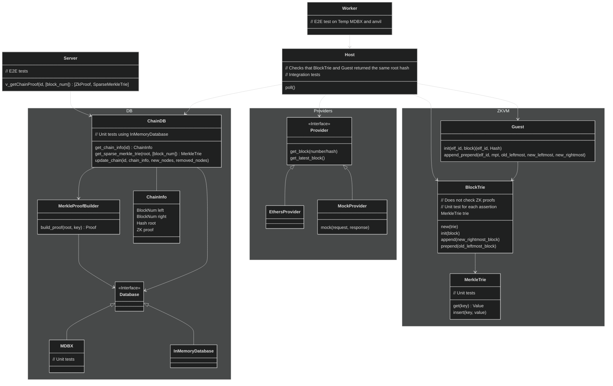

# Proving Coherence

## Naive Chain Proof Cache

We need a way to prove that a set of hashes belongs to the same chain. A naive way to do this is to hash all of the subsequent blocks, from the oldest to the most recent, and then verify that each block hash is equal to the **parentHash** value of the following block. If all the hashes from our set appear along the way, then they all belong to the same chain.

See the diagram below for a visual representation.


Unfortunately, this is a slow process, especially if the blocks are far apart on the time scale. Fortunately, with the help of Chain Proof Cache, this process can be sped up to logarithmic time.

## Chain Proof Cache

The Chain Proof Cache service maintains two things:
- a Chain Proof Cache structure (a Merkle Patricia Trie) that stores block hashes,
- a zk-proof 𝜋 that all these hashes belong to the same chain.

Given these two elements, it is easy to prove that a set of hashes belongs to the same chain.
1. It needs to be verified that all the hashes are part of the Chain Proof Cache structure.
2. 𝜋 needs to be verified.

### Chain Proof Cache (BPC) structure

The Chain Proof Cache structure is a dictionary that stores a `<block_number, block_hash>` mapping. It is implemented using a Merkle Patricia Trie. This enables us to prove that a set of hashes is part of the structure (point 1 from the previous paragraph) by supplying their corresponding Merkle proofs.


#### Adding hashes to the BPC structure and maintaining 𝜋

At all times, the BPC structure stores a sequence of consecutive block hashes that form a chain. In other words, we preserve the invariant that:
- block numbers contained in the structure form a sequence of consecutive natural numbers,
- for every pair of block numbers `i, i+1` contained in the structure, `block(i + 1).parentHash = hash(block(i))`.

Every time a block is added, 𝜋 is updated. To prove that after adding a new block, all the blocks in the BPC structure belong to the same chain, two things must be done:
- The previous 𝜋 must be verified.
- It must be ensured that the hash of the new block 'links' to either the oldest or the most recent block.

### Recursive proofs

In an ideal world - ZK Circuit will have access to its own ELF ID and therefore be able to verify the proofs produces by its previous invocations recursively. Unfortunately because ELF ID is a hash of a binary - it can't be included in itself.

Therefore, we extract ELF ID into an argument and "pipe" it through all the proofs. We also add it to an output.
Finally - when verifying this proof within the call proof - we check ELF ID against a hard-coded constant. This can be done there as **call** and **chain** are different circuits and having an ID of one within the other does not present the cycle mentioned above.

We can reason about soundness backwards. If someone provided the proof which has correct ELF ID in the output and verifies with correct ELF ID - it also had correct ELF ID in the inputs and therefore correctly verified the internal proof.

If one would try to generate the proof with ELF ID for an empty circuit (no assertions) - they can do that but:
* either the output will not match;
* or the proof will not verify with our ELF ID.

### Implementation

Guest code exposes two functions:
* `initialize()` - Initializes the MPT and inserts first block;
* `append_and_prepend()` - Extends the MPT inserting new blocks from the right and from the left while checking invariants and verifying previous proofs. In order to understand it's logic - we first explain in pseudocode how would a single append and a single prepend work before jumping into batch implementation.

#### Initialize

The `initialize()` function is used to create Chain Proof Cache structure as a Merkle Patricia Trie (MPT) and insert the initial block hash into it. It takes the following arguments:

- **elf_id**: a hash of the guest binary.
- **block**: the block header of the block to be added.

It calculates the hash of the block using the keccak256 function on the RLP-encoded block. Then it inserts this hash into the MPT at the position corresponding to the block number. Notice that no invariants about neighbours are checked as there are no neighbours yet.

```rs
fn initialize(elf_id: Hash, block: BlockHeader) -> (MptRoot, elf_id) {
    let block_hash = keccak256(rlp(block));
    let mpt = new SparseMpt();
    mpt.insert(block.number, block_hash);
    (mpt.root, elf_id)
}
```

#### Append

The `append()` function is used to add a most recent block to the Merkle Patricia Trie. It takes the following arguments:

- **elf_id**: a hash of the guest binary,
- **new_rightmost_block**: the block header to be added,
- **mpt**: a sparse MPT containing two paths: one from the root to the parent block and one from the root to the node where the new block will be inserted,
- **proof (π)**: a zero-knowledge proof that all contained hashes so far belong to the same chain.
  This function ensures that the new block correctly follows the previous block by checking the parent block's hash. If everything is correct, it inserts the new block's hash into the trie.

```rs
fn append(elf_id: Hash, new_rightmost_block: BlockHeader, mpt: SparseMpt<ParentBlockIdx, NewBlockIdx>, proof: ZkProof) -> (MptRoot, elf_id) {
    risc0_std::verify_zk_proof(proof, (mpt.root, elf_id), elf_id);
    let parent_block_idx = new_rightmost_block.number - 1;
    let parent_block_hash = mpt.get(parent_block_idx);
    assert_eq(parent_block_hash, new_rightmost_block.parent_hash, "Block hash mismatch");
    let block_hash = keccak256(rlp(new_rightmost_block));
    let new_mpt = mpt.insert(new_rightmost_block.number, block_hash);
    (new_mpt.root, elf_id)
}
```

#### Prepend

The `prepend()` function is used to add a new oldest block to the Merkle Patricia Trie. It takes the following arguments:

- **elf_id**: a hash of the guest binary.
- **old_leftmost_block**: the full data of the currently oldest block already stored in the MPT.
- **mpt**: a sparse MPT containing the path from the root to the child block and the new block's intended position.
- **proof**: a zero-knowledge proof that all contained hashes so far belong to the same chain.
  The function verifies the proof to ensure the full data from the child block fits the MPT we have so far. If the verification succeeds, it takes the `parent_hash` from the currently oldest block and inserts it with the corresponding number into the MPT. Note that we don't need to pass the full parent block as the trie only store hashes. However, we will need to pass it next time we want to prepend.

```rs
fn prepend(elf_id: Hash, old_leftmost_block: BlockHeader, mpt: SparseMpt<ChildBlockIdx, NewBlockIdx>, proof: ZkProof) -> (MptRoot, elf_id) {
    risc0_std::verify_zk_proof(proof, (mpt.root, elf_id), elf_id);
    let old_leftmost_block_hash = mpt.get(old_leftmost_block.number);
    assert_eq(old_leftmost_block_hash, keccak256(rlp(old_leftmost_block)), "Block hash mismatch");
    let new_mpt = mpt.insert(old_leftmost_block.number - 1, old_leftmost_block.parent_hash);
    (new_mpt.root, elf_id)
}
```

#### Batch version

In order to save on proving costs and latency - we don't expose singular versions of append and prepend but instead - a batch version. It checks the ZK proof only once at the beginning. The rest is the same.
```rs
fn append(mpt: SparseMpt, new_rightmost_block: BlockHeader) -> SparseMpt {
    let parent_block_idx = new_rightmost_block.number - 1;
    let parent_block_hash = mpt.get(parent_block_idx);
    assert_eq(parent_block_hash, new_rightmost_block.parent_hash, "Block hash mismatch");
    let block_hash = keccak256(rlp(new_rightmost_block));
    let new_mpt = mpt.insert(new_rightmost_block.number, block_hash);
    new_mpt
}

fn prepend(mpt: SparseMpt, old_leftmost_block: BlockHeader) -> SparseMpt {
    let old_leftmost_block_hash = mpt.get(old_leftmost_block.number);
    assert_eq(old_leftmost_block_hash, keccak256(rlp(old_leftmost_block)), "Block hash mismatch");
    let new_mpt = mpt.insert(old_leftmost_block.number - 1, old_leftmost_block.parent_hash);
    new_mpt
}

fn append_prepend(
  elf_id: Hash,
  prepend_blocks: [BlockHeader],
  append_blocks: [BlockHeader],
  old_leftmost_block: BlockHeader,
  mpt: SparseMpt<[NewLeft..OldLeft], [OldRight...NewRight]>,
  proof: ZkProof
) -> (MptRoot, elf_id) {
    risc0_std::verify_zk_proof(proof, (mpt.root, elf_id), elf_id);
    for block in append_blocks {
      mpt = append(mpt, block);
    } 
    for block in prepend_blocks.reverse() {
      mpt = prepend(mpt, old_leftmost_block);
      old_leftmost_block = block
    }
    (new_mpt.root, elf_id)
}
```

### Prove Chain server

Chain Proof Cache structure is stored in a distinct type of vlayer node, specifically a JSON-RPC server. It consists of a single call `v_getChainProof(chain_id: number, block_numbers: number[])`. 


[Detailed JSON-RPC API docs](../../api.md)

### Diagram
