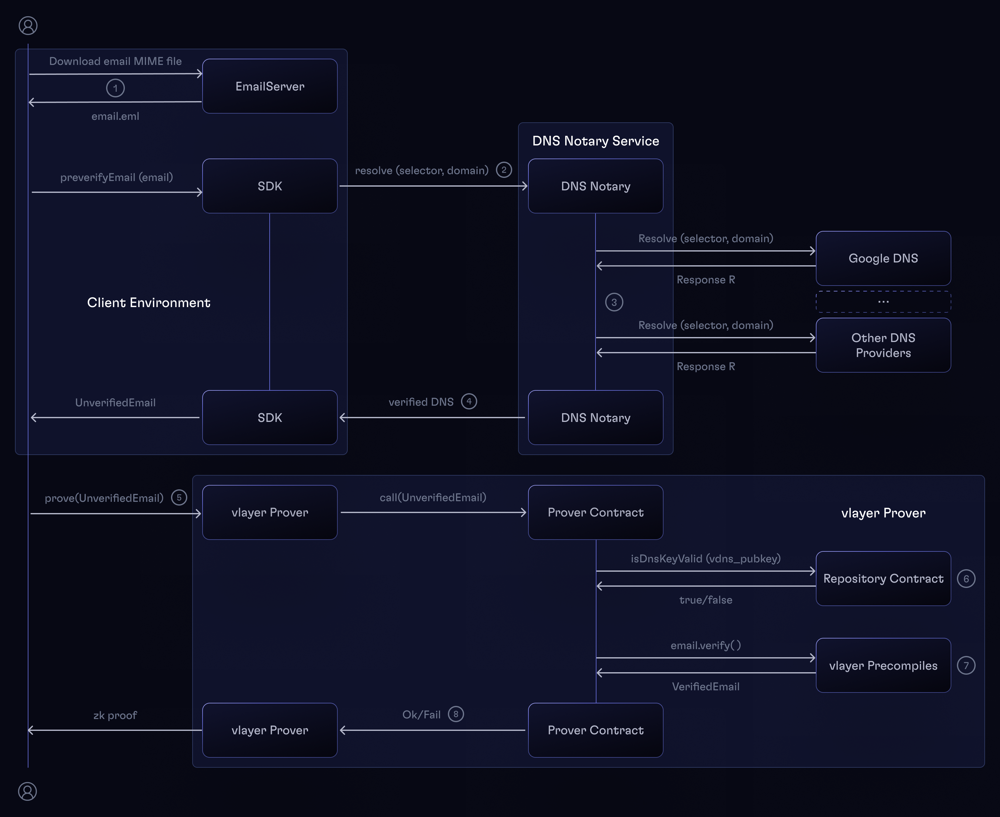

# Email Proofs Architecture

## Email proof sequence flow

Generating and ZK-proving an Email Proof consists of the following steps:
1. The received email MIME file is extracted from the email client.
2. The `preverifyEmail` in the SDK prepares the `UnverifiedEmail` struct that is ready to be sent to the Prover Contract.
    - Performs basic preverification - checks if the `DKIM-Signature` header is present.
    - Calls the `DNS Notary` to get the verification data of the sender's domain.
    - Note that all these steps can be performed without the `vlayerSDK`.
3. The `DNS Notary` fetches the public key used to sign the email from a number of DNS providers, compares the results, and if there's a consensus among them, signs the result with its private key.
4. The DNS record with it's signature and the raw email together form the `UnverifiedEmail` struct.
5. A `v_call` is made to the vlayer server with the `UnverifiedEmail` struct as well as the rest of the Prover contract arguments as calldata, chain ID, and the address of the deployed Prover contract.
6. The Prover contract must use the `EmailProofLib`, where the `DNS Notary` public key is verified. The `EmailProofLib` library calls the `Repository` contract to verify whether the `DNS Notary` public key is valid. It also checks the signature TTL against the current block timestamp.
7. Next, the `EmailProofLib` contract calls the `email_proof.verify(UnverifiedEmail)` custom precompile (see [Precompiles](./prover.md#precompiles)), which validates the Email Proof, parses the email MIME file, and returns a `VerifiedEmail`.
8. If the verification is successful, the `EmailProofLib` returns the [`VerifiedEmail`](./solidity.md#verified-email) struct to the Prover contract. Otherwise, it will revert.