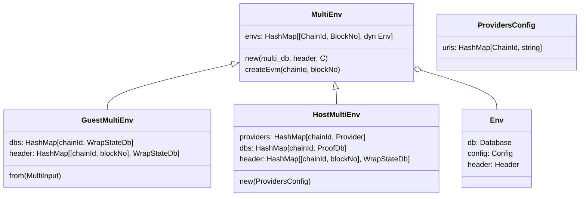
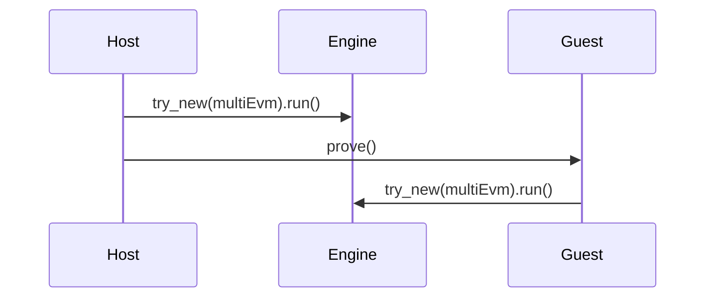

# Teleport and time-travel

To support execution on multiple blocks and multiple chains, we span multiple revms' instances during Engine execution. This in turn, requires support for spawning many `Envs`, with many instances and various types of both `DB` and `Header`. `MultiEnv` is a struct, responsible for handling databases and headers. There are two variants of `MultiEnv`: `GuestMultiEnv` and `HostMultiEnv`, with following responsibilities:

- `HostMultiEnv` creates `Databases` and `Headers` dynamically, utilizing Providers created from `ProvidersConfig`, by fetching data from Ethereum Nodes. Then, it is serialized to be send to Guest.
- `GuestMultiEnv` provides all required data, from a cached copy deserialized at the beginning of Guest execution.

See diagram below for a sequence of events.

