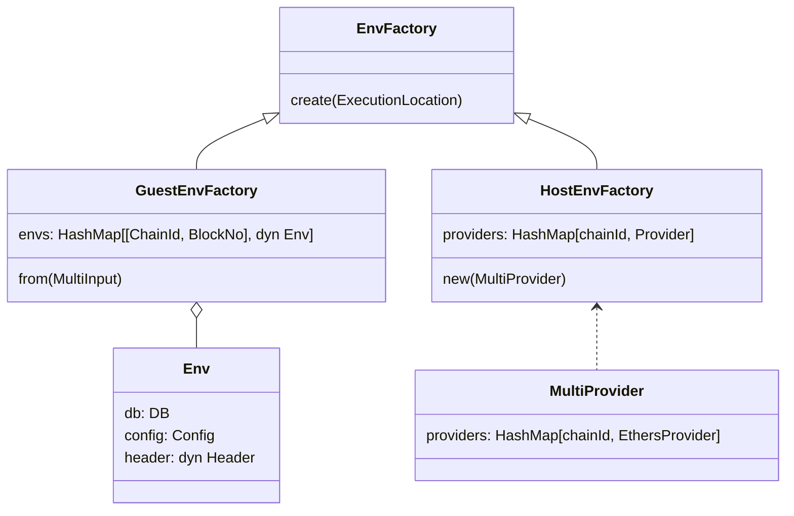

# Teleport and time-travel

To support execution on multiple blocks and multiple chains, we span multiple revms' instances during Engine execution.

## Generic parameter DB
Note that Engine is parametrized with generic type DB, as it needs to run in revm in with different Database in two different contexts: Guest and Host.

```rust
struct Engine<DB: Database> {
  ...
}
```

This parametrization will bubble to several related traits and structs: `EvmEnv`, `EnvFactory`, `HostEnvFactory`, `GuestEnvFactory`.

## Env
`Env` represents a configuration required to create a revm instance. Depending on the context it might be instantiated with `ProofDB` (Host) or `WrapStateDB` (Guest).

It also parametrized via dynamic dispatch by Header type, which may differ for different hard forks or networks.

See the code snippet blow.

```rust
pub struct EvmEnv<DB> {
    pub db: DB,
    pub cfg_env: CfgEnvWithHandlerCfg,
    pub header: Box<dyn Sealed<EvmBlockHeader> > ,
}
```

## EvnEnvFactory

`EnvFactory` is a type, responsible for creation of `EvmEnv` and in consequence revm instances. There are two variants of `EnvFactory`:
- `HostEnvFactory` creates `Databases` and `Headers` dynamically, utilizing Providers created from `MultiProvider`, by fetching data from Ethereum Nodes. Then, the data is serialized to be send to Guest.
- `GuestEnvFactory` provides all required data, from a cached copy deserialized at the beginning of Guest execution.




