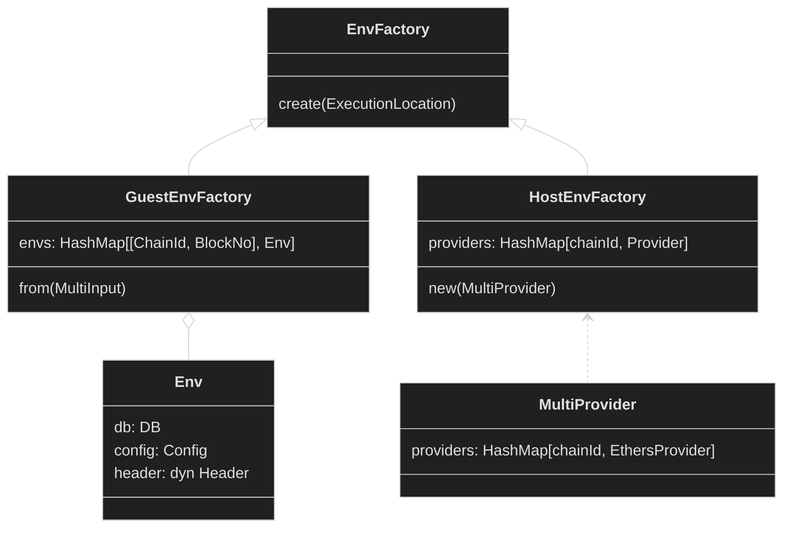
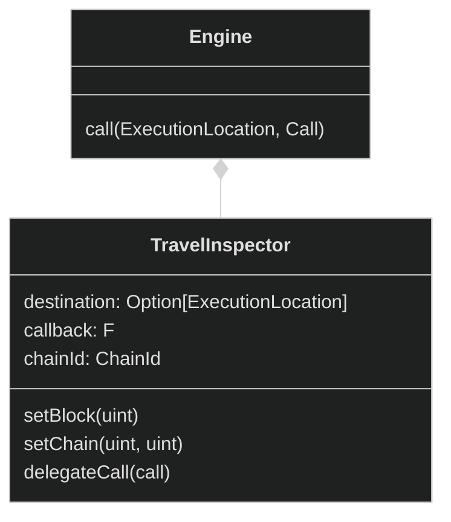

# Teleport and time-travel

To support execution on multiple blocks and multiple chains, we span multiple revms' instances during Engine execution.

## Generic parameter DB
Note that Engine is parametrized with generic type DB, as it needs to run in revm with different Database in two different contexts: Guest and Host.

```rust
struct Engine<DB: DatabaseRef> {
  ...
}
```

This parametrization will bubble to several related traits and structs: `EvmEnv`, `EnvFactory`, `HostEnvFactory`, `GuestEnvFactory`.

## EvmEnv
`EvmEnv` represents a configuration required to create a revm instance. Depending on the context, it might be instantiated with `ProofDB` (Host) or `WrapStateDB` (Guest).

It is also implicitly parametrized via dynamic dispatch by Header type, which may differ for various hard forks or networks.

See the code snippet below.

```rust
pub struct EvmEnv<DB> {
    pub db: DB,
    pub cfg_env: CfgEnvWithHandlerCfg,
    pub header: Box<dyn EvmBlockHeader> ,
}
```

## EvmEnvFactory

`EnvFactory` is a type, responsible for creation of `EvmEnv` and, in consequence, revm instances. There are two variants of `EnvFactory`:
- `HostEnvFactory` creates `Databases` and `Headers` dynamically, utilizing Providers created from `MultiProvider`, by fetching data from Ethereum Nodes. Then, the data is serialized to be sent to Guest.
- `GuestEnvFactory` provides all required data returned from a cached copy deserialized at the beginning of Guest execution.



## Engine

`Engine`'s responsibility is to execute calls. To do so, `Engine` spawns revms instances on demand. 
Engine calls are intercepted by `TravelInspector`. 

The role of the `TravelInspector` is to intercept calls related to [time travel](/features/time-travel.html) and [teleport](/features/teleport.html) features.
It stores the destination location (set by `setBlock` and `setChain` calls) and delegates the call back to the `Engine` if needed.




## Testing

Tests are run in a custom `ContractRunner` forked from [forge](https://github.com/foundry-rs/foundry/blob/6bb5c8ea8dcd00ccbc1811f1175cabed3cb4c116/crates/forge/src/runner.rs).

In addition to the usual functionality, tests run by vlayer can use the `execProver` feature. The next call after `execProver` will be executed in the vlayer `Engine`.

Runner is extended with a custom Inspector that delegates certain calls to an instance of `Engine`. The design is similar to `TravelInspector`.