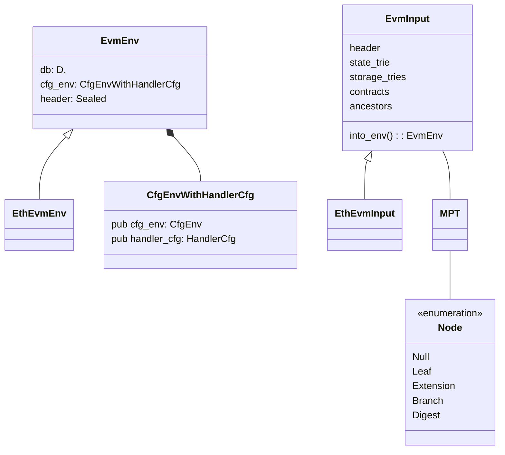
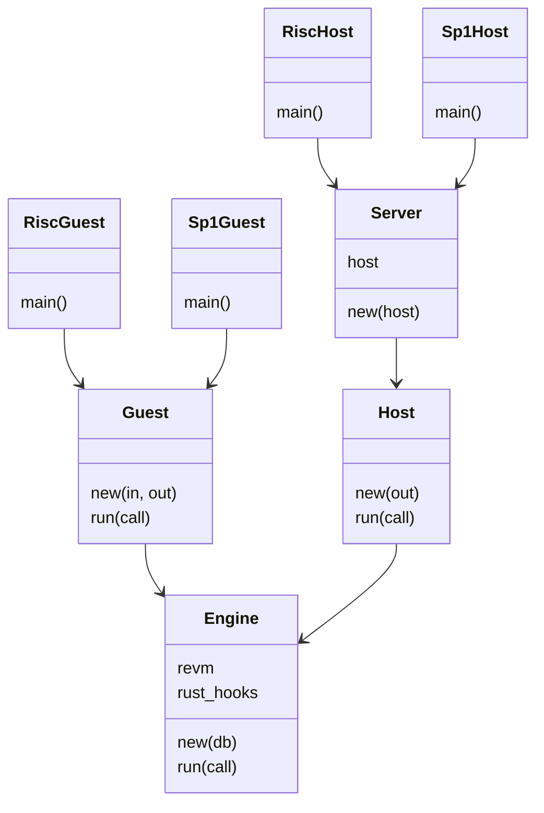

# Prover architecture

On the high level, vlayer runs zkEVM that produces proof of proper execution. Under the hood, vlayer is written in Rust that is compiled to zero knowledge proofs. Currently, Rust is compiled with [RISC Zero](https://www.risczero.com/), but we aim to build vendor-lock free solutions working on multiple zk stacks, like [sp-1](https://github.com/succinctlabs/sp1) or [Jolt](https://github.com/a16z/jolt). Inside rust [revm](https://github.com/bluealloy/revm) is executed.

Our architecture is inspired by RISC Zero [steel](https://github.com/risc0/risc0-ethereum/tree/main/steel), with 3 main components, that can be found in `rust/` subdirectories:

- host - (in `host`) - accepts the request, runs a preflight during which it collects all data required by the guest. Then, guest proving is triggered.
- guest - (in `guest_wrapper/guest`) - performs execution of code inside zkevm.
- guest-wrapper - (in `guest_wrapper`) - Compiles guest to [RISC Zero](https://doc.rust-lang.org/rustc/platform-support/riscv32im-risc0-zkvm-elf.html) target and makes it available to be run inside host. It can be considered Rust equivalent of code generation script.

Host passes arguments to guest via standard input like functionality and similarly guests returns values by standard output like functionality.

> In ZK terms, all inputs are **private** and all outputs are **public**. If you need public inputs - return them as the part of output.

## Execution and proving

zkVM works in isolation, without access to disk or network.

On the other hand, when executing Solidity code in guest - it needs access to ethereum state and storage. State consist of ethereum accounts (i.e. balances, contracts code and nonces) and storage consist of smart contract variables.

Hence, all state and storage needs to be passed via input.

However, all input should be considered insecure. Therefore, validity of all state and storage needs to be proven.

> **Note:** In off-chain execution the notion of the current block doesn't exist, hence we always access Ethereum at specific historical block. The block number can be the latest mined block available on the network. This is different than the current block inside on-chain execution, which can access the state at the moment of execution of the given transaction.

To deliver all necessary proofs, following steps are performed:

- In preflight, we execute Solidity code on the host. Each time the db is called the value is fetched via Ethereum JSON RPC. Then, the proof is stored in the local database called ProofDb.
- Serialized content of ProofDb is passed via stdin to guest.
- Guest deserializes content into a local database StateDb.
- Solidity code is executed inside revm using local copy of StateDb.

Note that solidity execution is deterministic, hence database in the guest has exactly the data it requires.

### Databases

We have two different databases run in two different places. Each is a composite database:

- **host** - runs `ProofDb`, which proxies queries to `ProviderDb`. In turn, `ProviderDb` forwards the call to Ethereum RPC provider. Finally, `ProofDb` stores information about what proofs will need to be generated for the guest.
- **guest** - runs WrapStateDb, which proxies calls to `StateDb`.
  - `StateDb` consists of state passed from the host and has only the content required to be used by deterministic execution of solidity code in guest. Data in the `StateDb` is stored as sparse Ethereum Merkle Patricia Tries, hence access to accounts and storage serves as verification of state and storage proofs.
  -  `WrapStateDb` is an [adapter](https://en.wikipedia.org/wiki/Adapter_pattern) for `StateDb` that implements Database trait. It additionally do caching of accounts, for querying storage, so that account is only fetched once for multiple storage queries.

```mermaid
classDiagram

class Database {
    basic(address): AccountInfo?
    code_by_hash(code_hash) Bytecode?
    storage(address, index) U256?
    block_hash(number) B256?
}

class StateDb {
    state_trie: MerkleTrie
    storage_tries: HashMap
    contracts: HashMap
    block_hashes: HashMap
    account(address: Address) StateAccount?
    code_by_hash(hash: B256) Bytes?
    block_hash(number: U256) B256
    storage_trie(root: &B256) MerkleTrie?
}

class ProviderDb {
    provider
}

class WrapStateDb {
    stateDb
}

class ProofDb {
    accounts: HashMap
    contracts: HashMap
    block_hash_numbers: HashSet
    providerDb
}

Database <|-- WrapStateDb
Database <|-- ProviderDb
Database <|-- ProofDb
WrapStateDb *-- StateDb
ProviderDb *-- Provider
ProofDb *-- ProviderDb
Database..AccountInfo
StateDb..StateAccount

class AccountInfo {
    balance: U256
    nonce: u64
    code_hash: B256
    code: Bytecode?
}

class StateAccount {
    balance: U256
    nonce: TxNumber
    code_hash: B256
    storage_root: B256
}

```

### Environments

The environment in which execution will happen is stored in the generic type `EvmEnv<D, H>`, where `D` is a connected database and `H` represents the type of block header. Database connected to Engine vary between Guest, Host and testing environment.

#### Block header

The block header type might vary on different sidechains and L2s. Currently, `EthBlockHeader` originally implemented by Steel is used. Whether we can reuse the type from Reth instead is an open question.

#### Life cycle

The environment is created in the host and converted into `EvmInput` and serialized. Data is then sent over standard input to the guest and deserialized in the guest. `EthEvmInput` is an `EvmInput` specialized by `EthBlockHeader`.

`EvmInput` stores state and storage trees as sparse Ethereum Merkle Patricia Trie implemented by `MPT` structures witch is a wrapped Node. Sparse tree is very similar to standard MPT in that it includes four standard node types, however it only data necessary to execution and in place of unused nodes uses special node called `Digest`.

Data is deserialized by host with `EVMInput.into_env()` function. Additionally, this method verifies header hashes (current and ancestors). `StateDb::new` calculates bytecodes hashes and storage roots.

### Verification of input data

The guest is required to verify all data provided by the host. Validation of data correctness is split between multiple functions:
- `EVMInput.into_env` verifies:
    - equality of subsequent ancestor block hashes
    - equality of header.state_root and actual state_root
- `StateDb::new` calculates:
    - smart contracts bytecode hashes
    - storage roots
- `MerkleTrie::from_rlp_nodes` effectively verifies merkle proofs by:
    - Calculating the hash of each node
    - Reconstructing the tree in `MerkleTrie::resolve_trie`

### Components
There are two main entry creates to the system: `risk_host` and `risk_guest`. Each of them should be a few simple lines of code and they should implement no logic. They depend on `Host` and `Guest` crates respectively.
The part of code shared between is host and guest is stored in separate component `Engine`.
In the future, there might be more entry points i.e. `Sp1Host` and `Sp1Guest`.

Below is a short description of components:

- Host is a http server. Host main purpose is to parse http request and execute logic and convert result to http response.

- Guest is a program communicates via reading input and writing to output. For simplicity, all input is deserialized into `GuestInput` and all output is serialized into `GuestOutput`. Guest main purpose is to parse input and run logic from `Engine`.

- Engine consist of share logic between `Host` and `Guest`. In host, it is used to run preflight and in guest it is used to perform proving. It mainly do two things:
    - run rust preprocessing of call (e.g. mail signature verification)
    - run solidity contracts inside revm

### Error handling
Error handling is done via custom semantic `HostError` enum type, which is converted into http code and human readable string by the server.

Instead of returning a result, to handle errors, guest panics. It does need to panic with human readable error, which should be convert on host to semantic `HostError` type. As execution on guest is deterministic and should never fail after successful preflight, panic message should be informative for dev team.

### Dependency injection
All components should follow dependency injection pattern, which means all dependencies should be passed via constructors. Hence, components should not need to touch members of members. There should be one build function per component, with accepts add it's dependencies.

### Testing

Test types:
- unit tests
- integration tests for components `Engine`, `Host`, `Guest`
- integration test of HttpServer, with:
    - single happy path test per http end point
    - single test per error code (no need to do per-error-per-end point test)
- end-to-end test, running a server and settle result on-chain

### Security audit

We will be auditing 100% of guest code, which consist of: `RiscGuest`, `Guest`, `Engine`.

We should minimize amount of dependencies to all three of them. Especially, there should be no code in `Engine` used by host only.

