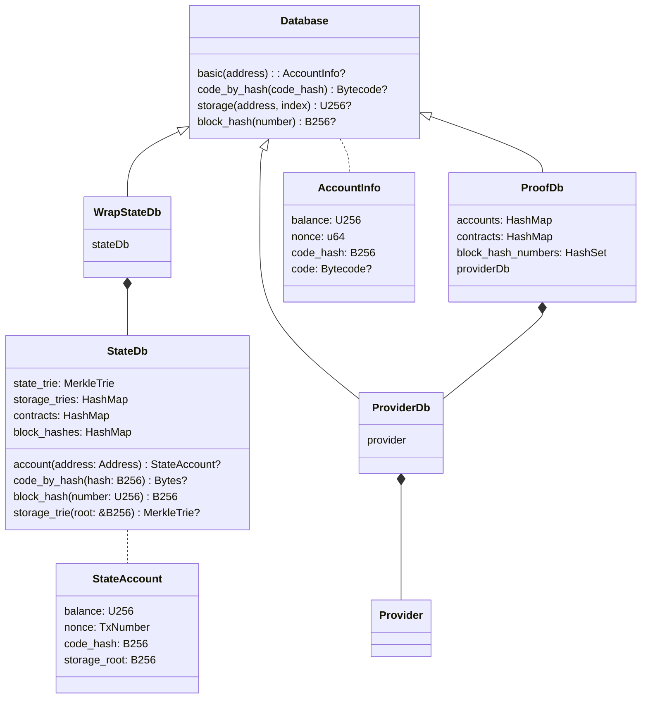
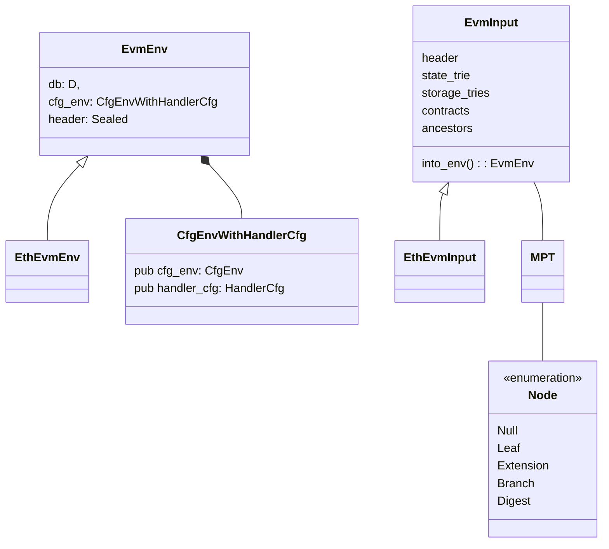
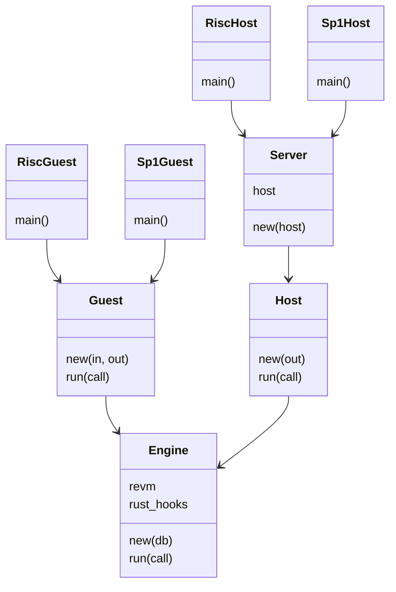

# Prover architecture

On the high level, vlayer runs zkEVM that produces a proof of proper execution. Under the hood, vlayer is written in Rust that is compiled to zero knowledge proofs. Currently, Rust is compiled with [RISC Zero](https://www.risczero.com/), but we aim to build vendor-lock free solutions working on multiple zk stacks, like [sp-1](https://github.com/succinctlabs/sp1) or [Jolt](https://github.com/a16z/jolt). Inside rust [revm](https://github.com/bluealloy/revm) is executed.

Our architecture is inspired by RISC Zero [steel](https://github.com/risc0/risc0-ethereum/tree/main/steel), with 3 main components that can be found in `rust/` subdirectories:

- host - (in `host`) - accepts the request, runs a preflight, during which it collects all data required by the guest. Then, guest proving is triggered.
- guest - (in `guest_wrapper/guest`) - performs execution of the code inside zkEVM.
- guest-wrapper - (in `guest_wrapper`) - Compiles the guest to [RISC Zero](https://doc.rust-lang.org/rustc/platform-support/riscv32im-risc0-zkvm-elf.html) target and makes it available to be run inside the host. It can be considered Rust equivalent of a code generation script.

The host passes arguments to the guest via standard input, like functionality, and similarly, the guest returns values by standard output, like functionality.

> In ZK terms, all inputs are **private** and all outputs are **public**. If you need public inputs - return them as a part of output.

## Execution and proving

zkVM works in isolation, without access to a disk or network.

On the other hand, when executing Solidity code in the guest, it needs access to the Ethereum state and storage. The state consist of Ethereum accounts (i.e. balances, contracts code and nonces) and the storage consist of smart contract variables.

Hence, all the state and storage needs to be passed via input.

However, all input should be considered insecure. Therefore, validity of all the state and storage needs to be proven.

> **Note:** In off-chain execution, the notion of the current block doesn't exist, hence we always access Ethereum at a specific historical block. The block number can be the latest mined block available on the network. This is different than the current block inside on-chain execution, which can access the state at the moment of execution of the given transaction.

To deliver all necessary proofs, the following steps are performed:

- In preflight, we execute Solidity code on the host. Each time the db is called, the value is fetched via Ethereum JSON RPC. Then, the proof is stored in the local database called ProofDb.
- The serialized content of ProofDb is passed via stdin to the guest.
- The guest deserializes content into a local database StateDb.
- Solidity code is executed inside revm using a local copy of StateDb.

Note that solidity execution is deterministic, hence database in the guest has exactly the data it requires.

### Databases

We have two different databases run in two different places. Each is a composite database:

- **host** - runs `ProofDb`, which proxies queries to `ProviderDb`. In turn, `ProviderDb` forwards the call to Ethereum RPC provider. Finally, `ProofDb` stores information about what proofs will need to be generated for the guest.
- **guest** - runs WrapStateDb, which proxies calls to `StateDb`.
  - `StateDb` consists of state passed from the host and has only the content required to be used by deterministic execution of the Solidity code in the guest. Data in the `StateDb` is stored as sparse Ethereum Merkle Patricia Tries, hence access to accounts and storage serves as verification of state and storage proofs.
  -  `WrapStateDb` is an [adapter](https://en.wikipedia.org/wiki/Adapter_pattern) for `StateDb` that implements Database trait. It additionally do caching of the accounts, for querying storage, so that the account is only fetched once for multiple storage queries.

### Environments

The environment in which the execution will take place is stored in the generic type `EvmEnv<D, H>`, where `D` is a connected database and `H` represents the type of the block header. The database connected to Engine varies between the Guest, Host and testing environment.

#### Block header

The block header type might vary on different sidechains and L2s. 

#### Life cycle

The environment is created in the host and converted into `EvmInput` and serialized. The data is then sent over standard input to the guest and deserialized in the guest. `EthEvmInput` is an `EvmInput` specialized by `EthBlockHeader`.

`EvmInput` stores state and storage trees as sparse Ethereum Merkle Patricia Trie implemented by `MPT` structures, which is a wrapped Node. The sparse tree is very similar to the standard MPT in that it includes four standard node types. However, it only keeps data necessary to execution and in place of unused nodes it uses a special node called `Digest`.

The data is deserialized by host with the `EVMInput.into_env()` function. Additionally, this method verifies header hashes (current and ancestors). `StateDb::new` calculates bytecodes hashes and storage roots.

### Verification of input data

The guest is required to verify all data provided by the host. Validation of data correctness is split between multiple functions:
- `EVMInput.into_env` verifies:
    - equality of subsequent ancestor block hashes
    - equality of `header.state_root` and actual `state_root`
- `StateDb::new` calculates:
    - smart contracts bytecode hashes
    - storage roots
- `MerkleTrie::from_rlp_nodes` effectively verifies merkle proofs by:
    - Calculating the hash of each node
    - Reconstructing the tree in `MerkleTrie::resolve_trie`

### Components
There are two main entry crates to the system: `risk_host` and `risk_guest`. Each of them should be a few simple lines of code and they should implement no logic. They depend on `Host` and `Guest` crates respectively.
The part of code shared between the host and guest is stored in a separate component - `Engine`.
In the future, there might be more entry points i.e. `Sp1Host` and `Sp1Guest`.

Below is a short description of the components:

- The `Host` is an http server. The `Host`'s main purpose is to parse an http request and execute logic and convert the result to an http response.

- The `Guest` is a program which communicates via reading input and writing to output. For simplicity, all input is deserialized into `GuestInput` and all output is serialized into `GuestOutput`. The `Guest`'s main purpose is to parse input and run logic from `Engine`.

- The `Engine` consists of share logic between the `Host` and the `Guest`. In the `Host`, it is used to run preflight and in the `Guest` it is used to perform proving. It mainly does two things:
    - runs Rust preprocessing of a call (e.g. mail signature verification)
    - runs Solidity contracts inside revm

### Error handling
Error handling is done via custom semantic `HostError` enum type, which is converted into http code and a human-readable string by the server.

Instead of returning a result, to handle errors, `Guest` panics. It does need to panic with a human-readable error, which should be converted on `Host` to a semantic `HostError` type. As execution on `Guest` is deterministic and should never fail after a successful preflight, the panic message should be informative for developers.

### Dependency injection
All components should follow the dependency injection pattern, which means all dependencies should be passed via constructors. Hence, components should not need to touch nested members.

There should be one build function per component, with accepts add its dependencies. <-- FIX ME

### Testing

Test types:
- unit tests
- integration tests for components `Engine`, `Host`, `Guest`
- integration test of `HttpServer`, with:
    - single happy path test per http endpoint
    - single test per error code (no need to do per-error-per-end point test)
- end-to-end test, running a server and settle result on-chain

### Security audit

We will be auditing 100% of guest code, which consists of: `RiscGuest`, `Guest` and `Engine`.

We should minimize amount of dependencies to all three of them. Especially, there should be no code in `Engine` used by `Host` only.

