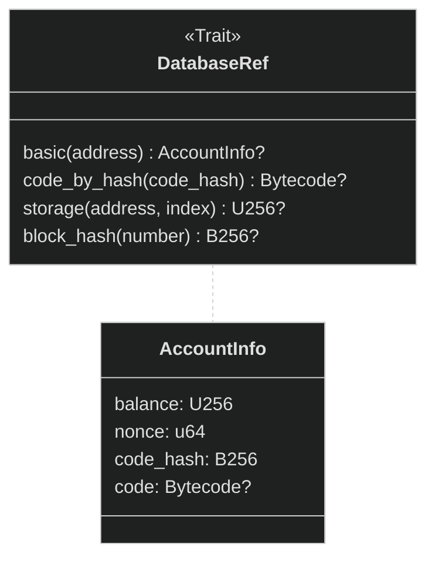
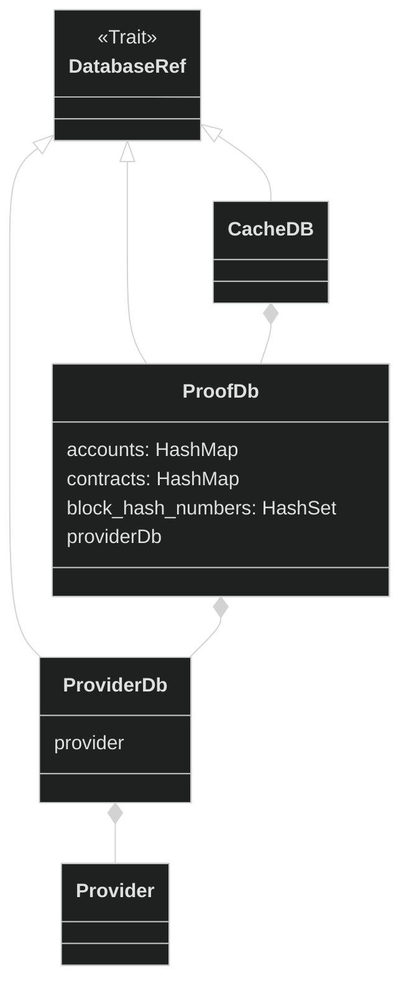
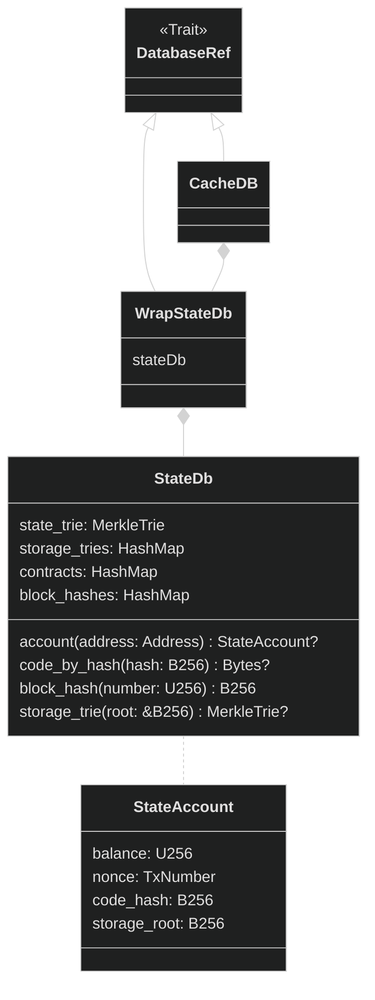
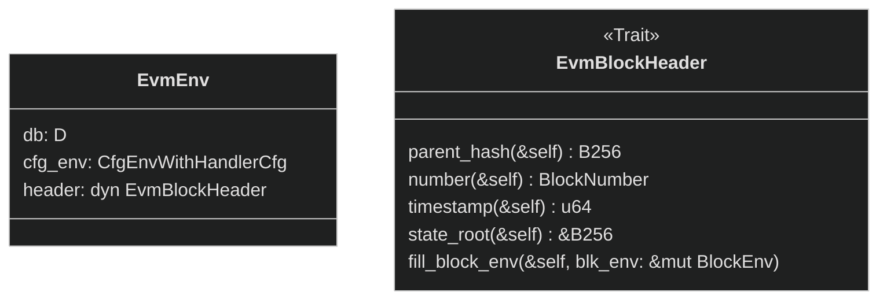
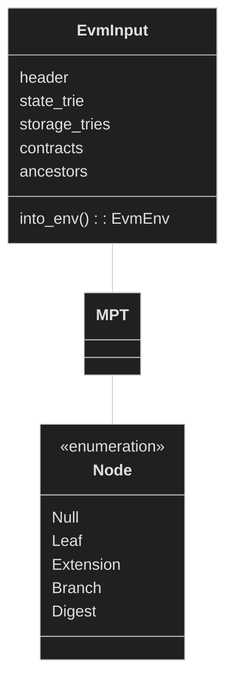

# Call prover architecture

On the high level, vlayer runs zkEVM that produces a proof of proper execution of `Prover` smart contract. Under the hood, vlayer is written in Rust that is compiled to zero knowledge proofs. Currently, Rust is compiled with [RISC Zero](https://www.risczero.com/), but we aim to build vendor-lock free solutions working on multiple zk stacks, like [sp-1](https://github.com/succinctlabs/sp1) or [Jolt](https://github.com/a16z/jolt). Inside rust [revm](https://github.com/bluealloy/revm) is executed.

Our architecture is inspired by RISC Zero [steel](https://github.com/risc0/risc0-ethereum/tree/main/steel), with two main components that can be found in `rust/services/call` directory:

- **Host** - (in `host`) - runs a preflight, during which it collects all data required by the guest. Then, guest proving is triggered.
- **Guest** - performs execution of the code inside zkEVM. Consists of three crates:
    * guest - (in `guest`) - Library that contains code for EVM execution and input validation
    * risc0_guest - (in `guest_wrapper/risc0_guest`) - Thin wrapper that uses RISC Zero ZKVM IO and delegates work to `guest`
    * guest_wrapper - (in `guest_wrapper`) - Compiles `risc0_guest` (using cargo build scripts) to a binary format (ELF) using [RISC Zero](https://doc.rust-lang.org/rustc/platform-support/riscv32im-risc0-zkvm-elf.html) target.

there are several other crates in the `rust/services/call` directory:
- **engine**: EVM Call execution shared by Guest and Host, used in both Host's preflight and Guest's zk proving;
- **precompiles**: Vlayer precompiles that extend the EVM capabilities with Email and Web Proof utils;
- **seal**: Utils for encoding Risc0 receipt into a Seal. Seal can be read and verified by the Verifier smart contract;
- **server**: Server routines accepting vlayer JSON RPC calls.

## Execution and proving

The host passes arguments to the guest via standard input (stdin), and similarly, the guest returns values via standard output (stdout).

zkVM works in isolation, without access to a disk or network.

On the other hand, when executing Solidity code in the guest, it needs access to the Ethereum state and storage. The state consist of Ethereum accounts (i.e. balances, contracts code and nonces) and the storage consist of smart contract variables.

Hence, all the state and storage needs to be passed via input.

However, all input should be considered insecure. Therefore, validity of all the state and storage needs to be proven.

> **Note:** In off-chain execution, the notion of the current block doesn't exist, hence we always access Ethereum at a specific historical block. The block number can be the latest mined block available on the network. This is different than the current block inside on-chain execution, which can access the state at the moment of execution of the given transaction.

To deliver all necessary proofs, the following steps are performed:

- In preflight, we execute Solidity code on the host. Each time the db is called, the value is fetched via Ethereum JSON RPC. Then, the proof is stored in the local database called `ProofDb`;
- serialized content of `ProofDb` is passed via stdin to the `guest`;
- `guest` deserializes content into a `StateDb`;
- Solidity code is executed inside `revm` using `StateDb`.

Since that Solidity execution is deterministic, database in the guest has exactly the data it requires.

### Databases

`revm` requires us to provide a DB which implements `DatabaseRef` trait (i.e. can be asked about accounts, storage, block hashes).

It's a common pattern to compose databases to orthogonalize the implementation.

We have **Host** and **Guest** databases

- **Host** - runs `CacheDB<ProofDb<ProviderDb>>`:
    * `ProviderDb`- queries Ethereum RPC Provider (i.e. Alchemy, Infura, Anvil);
    * `ProofDb` - records all queries aggregates them and collects EIP1186 (`eth_getProof`) proofs;
    * `CacheDB` - stores trusted seed data to minimize the amount of RPC requests. We seed caller account and some Optimism system accounts.
- **Guest** - runs `CacheDB<WrapStateDb<StateDb>>`:
    * `StateDb` consists of state passed from the host and has only the content required to be used by deterministic execution of the Solidity code in the guest. Data in the `StateDb` is stored as sparse Ethereum Merkle Patricia Tries, hence access to accounts and storage serves as verification of state and storage proofs;
    * `WrapStateDb` is an [adapter](https://en.wikipedia.org/wiki/Adapter_pattern) for `StateDb` that implements `Database` trait. It additionally does caching of the accounts, for querying storage, so that the account is only fetched once for multiple storage queries;
    * `CacheDB` - has the same seed data as it's Host version.

#### DatabaseRef trait

#### Host

#### Guest

### Environments

The environment in which the execution will take place is stored in the generic type `EvmEnv<D>`, where `D` is a database type.

The block header type varies between sidechains and L2s. `EvmBlockHeader` trait allows us to access header data in a homogenous way and use dynamic dispatch.

`cgf_env` is revm type that contains EVM configuration (chain_id, hard fork).

#### Lifecycle

The environment is created in the Host and converted into `EvmInput` and serialized. The data is then sent over standard input to the guest and deserialized in the guest.

`EvmInput` stores state and storage trees as sparse Ethereum Merkle Patricia Trie. The sparse tree is very similar to the standard MPT in that it includes four standard node types. However, it only keeps data necessary to execution and in place of unused nodes it uses a special node called `Digest`.

The data is serialized by host with the `EVMInput.into_env()` function. Additionally, this method verifies header hashes (current and ancestors). `StateDb::new` calculates bytecodes hashes and storage roots.

### Verification of input data

Guest is required to verify all data provided by the Host. Validation of data correctness is split between multiple functions:
- `EVMInput.into_env` verifies:
    - equality of subsequent ancestor block hashes
    - equality of `header.state_root` and actual `state_root`
- `StateDb::new` calculates:
    - smart contracts bytecode hashes
    - storage roots
- `MerkleTrie::from_rlp_nodes` effectively verifies merkle proofs by:
    - Calculating the hash of each node
    - Reconstructing the tree in `MerkleTrie::resolve_trie`

### Error handling

Error handling is done via `HostError` enum type, which is converted into http code and a human-readable string by the server.

Instead of returning a result, to handle errors, `Guest` panics. It does need to panic with a human-readable error, which should be converted on `Host` to a semantic `HostError` type. As execution on `Guest` is deterministic and should never fail after a successful preflight, the panic message should be informative for developers.

### Dependency injection
All components should follow the dependency injection pattern, which means all dependencies should be passed via constructors. Hence, components should not need to touch nested members.

There should be one build function per component.

### Testing

Test types:
- unit tests
- integration tests for components `Engine`, `Host`, `Guest`
- integration test of `HttpServer`, with:
    - single happy path test per http endpoint
    - single test per error code (no need to do per-error-per-end point test)
- end-to-end test, running a server and settle result on-chain

### Security audit

We will be auditing 100% of guest code, which consists of: `RiscGuest`, `Guest` and `Engine`.

We should minimize amount of dependencies to all three of them. Especially, there should be no code in `Engine` used by `Host` only.

