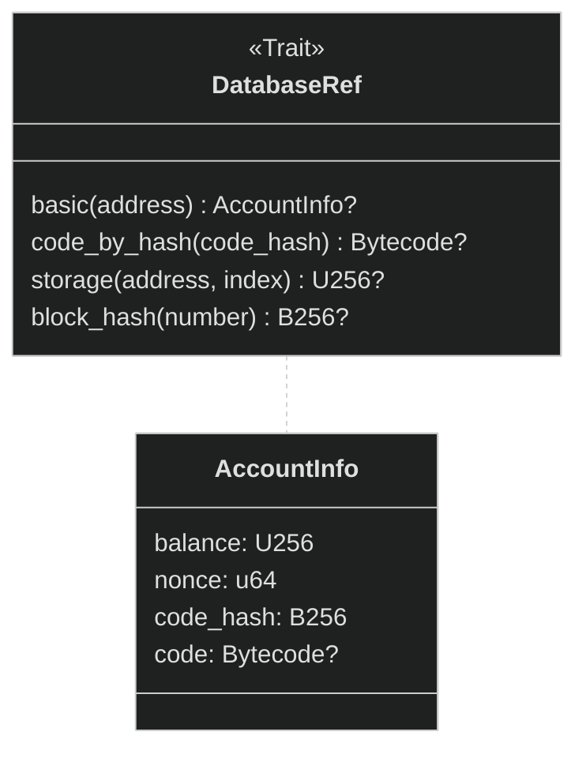
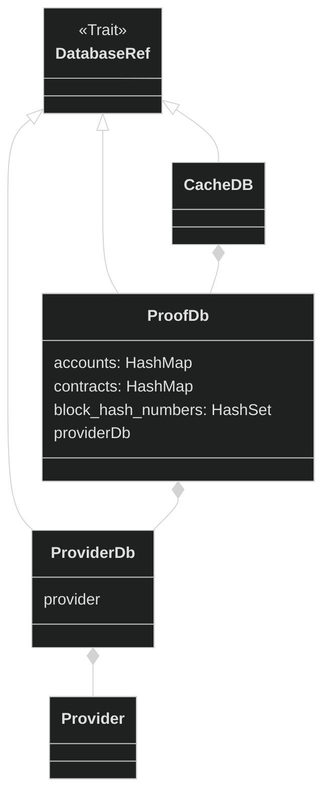
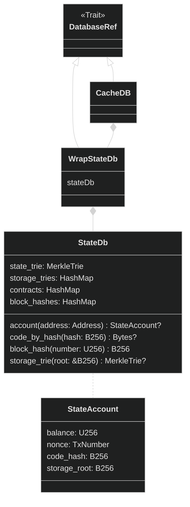
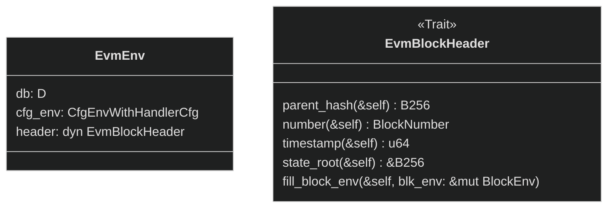

# Vlayer Architecture

Vlayer infrastructure enables three key functionalities: **_accessing_** different sources of verifiable data, **_aggregating_** this data in a verifiable way to obtain verifiable result and **_using the verifiable result on-chain_**.

It supports accessing verifiable data from three distinct sources:: HTTP requests, emails and EVM state and storage. For each source, a proof of validity can be generated:
- HTTP requests can be proven via *TLS Notary* by verifying TLS signatures and checking the domain is valid
- Email contents can be proven by verifying DKIM signatures and checking the sender domain
- EVM state and storage proofs can be verified against the block hash via Merkle Proofs

Before Vlayer, ZK programs were application-specific and proved a single source of data. Vlayer allows you to write a Solidity smart contract (called **Prover**) that acts as a glue between all three possible data sources and enables you to **aggregate** this data in a verifiable way. We not only prove that the data we use is valid, but we can also process it and prove it was processed correctly by the **Prover**.

### Aggregation examples

- **Prover** computing average *ERC20* balance of addresses
- **Prover** returning *true* if someone starred a *GitHub Org* by verifying a Web Proof

> **_Note_** Despite being named "Prover", the **Prover** contract does not compute the proof itself. Instead, it is executed inside the *zkEVM*, which produces the proof of the correctness of its execution.

**_Call Proof_** is a proof that we correctly executed the **Prover** smart contract and got the given result.

It can be later verified by a deployed **Verifier** contract to **use the verifiable result on-chain**.

But how is Call Proof obtained?

## Call Prover

To obtain Call Proofs, we use **Call Prover**. Its two most important elements are **Guest** and **Host**. The Guest is responsible for executing the code inside *zkEVM* to prove its execution. The Host prepares the data required by the Guest and sends it to the Guest.

These components can be found in the `rust/services/call` directory. Their structure and responsibilities are as follows:

- **Guest**: Performs execution of the code inside zkEVM. Consists of three crates:
    - `guest` (in `guest`): Library that contains code for EVM execution and input validation.
    - `risc0_guest` (in `guest_wrapper/risc0_guest`): Thin wrapper that uses RISC0 ZKVM I/O and delegates work to `guest`.
    - `guest_wrapper` (in `guest_wrapper`): Compiles `risc0_guest` (using cargo build scripts) to a binary format (ELF) using [RISC Zero](https://doc.rust-lang.org/rustc/platform-support/riscv32im-risc0-zkvm-elf.html) target.
- **Host** (in `host`): Runs a **_preflight_**, during which it collects all the data required by the guest. It retrieves data from online sources (RPC clients) and then triggers guest execution (which is done offline).

Our architecture is heavily inspired by RISC Zero [steel](https://github.com/risc0/risc0-ethereum/tree/main/steel).

Currently, the Guest is compiled with Risc0, but we aim to build vendor-lock free solutions working on multiple zk stacks, like [sp-1](https://github.com/succinctlabs/sp1) or [Jolt](https://github.com/a16z/jolt).

### Execution and proving

The Host passes arguments to the Guest via standard input (stdin), and similarly, the Guest returns values via standard output (stdout). zkVM works in isolation, without access to a disk or network.

On the other hand, when executing Solidity code in the Guest, it needs access to the Ethereum state and storage. The state consist of Ethereum accounts (i.e. balances, contracts code and nonces) and the storage consist of smart contract variables. Hence, all the state and storage needs to be passed via input.

However, all input should be considered insecure. Therefore, validity of all the state and storage needs to be proven.

> **_Note_:** In off-chain execution, the notion of the current block doesn't exist, hence we always access Ethereum at a specific historical block. The block number doesn't have to be the latest mined block available on the network. This is different than the current block inside on-chain execution, which can access the state at the moment of execution of the given transaction.

To deliver all necessary proofs, the following steps are performed:

1. In preflight, we execute Solidity code on the host. Each time the database is called, the value is fetched via Ethereum JSON RPC and the proof is stored in it. This database is called `ProofDb`
2. Serialized content of `ProofDb` is passed via stdin to the `guest`
3. `guest` deserializes content into a `StateDb`
4. Solidity code is executed inside `revm` using `StateDb`

Since that Solidity execution is deterministic, database in the guest has exactly the data it requires.

### Databases

`revm` requires us to provide a DB which implements `DatabaseRef` trait (i.e. can be asked about accounts, storage, block hashes).

It's a common pattern to compose databases to orthogonalize the implementation.

We have **Host** and **Guest** databases

- **Host** - runs `CacheDB<ProofDb<ProviderDb>>`:
    * `ProviderDb`- queries Ethereum RPC Provider (i.e. Alchemy, Infura, Anvil);
    * `ProofDb` - records all queries aggregates them and collects EIP1186 (`eth_getProof`) proofs;
    * `CacheDB` - stores trusted seed data to minimize the amount of RPC requests. We seed caller account and some Optimism system accounts.
- **Guest** - runs `CacheDB<WrapStateDb<StateDb>>`:
    * `StateDb` consists of state passed from the host and has only the content required to be used by deterministic execution of the Solidity code in the guest. Data in the `StateDb` is stored as sparse Ethereum Merkle Patricia Tries, hence access to accounts and storage serves as verification of state and storage proofs;
    * `WrapStateDb` is an [adapter](https://en.wikipedia.org/wiki/Adapter_pattern) for `StateDb` that implements `Database` trait. It additionally does caching of the accounts, for querying storage, so that the account is only fetched once for multiple storage queries;
    * `CacheDB` - has the same seed data as it's Host version.

#### DatabaseRef trait

#### Host

#### Guest

### Environments

The environment in which the execution will take place is stored in the generic type `EvmEnv<D>`, where `D` is a database type.

The block header type varies between sidechains and L2s. `EvmBlockHeader` trait allows us to access header data in a homogenous way and use dynamic dispatch.

`cgf_env` is revm type that contains EVM configuration (chain_id, hard fork).
