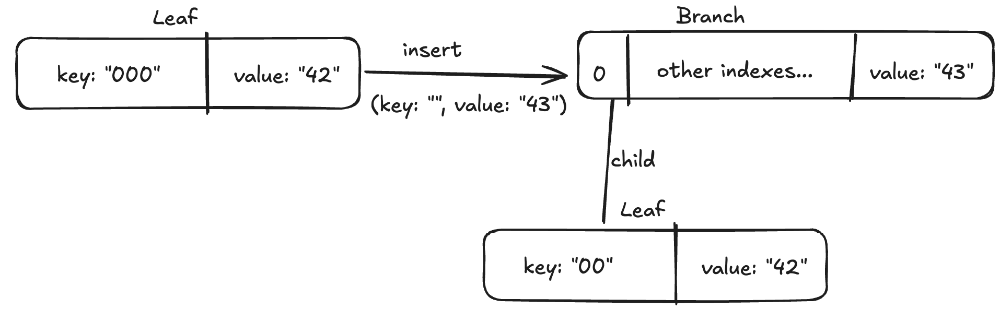
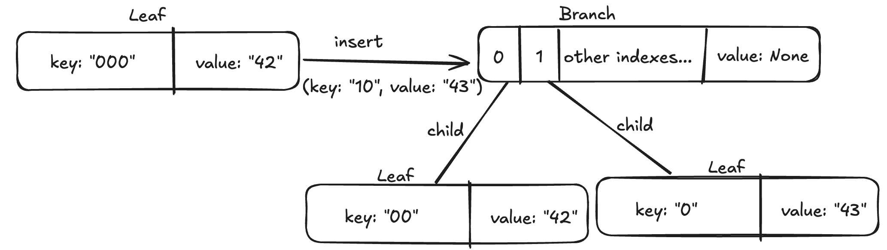
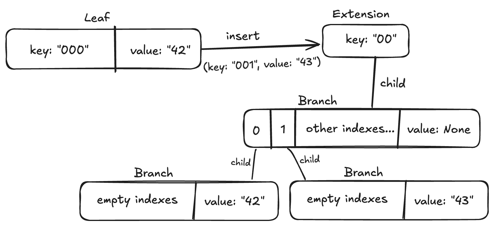

# Insert

Depending on the type of the node we insert to, `insert` method works differently. A key helper structure used in this function is `Entry`. To understand how this function works, we need to take a look at `Entry` first.

## Entry

The `(key, value)` pair is often represented in the `Node::insert` function using the `Entry` structure to facilitate efficient insertion into a trie. The `Entry` struct provides a convenient way to encapsulate both the `key` and `value`, allowing the `Node::insert` function to handle them as a single unit.

Its important features are:

- The `From<(K, V)> for Entry` implementation which allows for easy creation of an `Entry` from various types, enabling the insertion helper functions (like `insert_entry_into_branch` and `insert_entry_into_extension`) to accept a wide range of input formats.
- The `From<Entry> for Node` implementation which allows the creation of a `Node` directly from `Entry`, transforming `self` into `Branch` with value (in the case of empty keys) or `Leaf` (if key is not empty).

Insert function works differently depending on the type of node we are inserting to:

## Into Null

This happens only during the first insertion into the trie. `Node::Null` is never created later during the insertion in any way.

When we insert into `Node::Null`, we replace the `Null` node with a:
* `Branch` with a value, if the inserted value's key is empty
* `Leaf` otherwise.

## Into Digest

Insert into `Digest` node shouldn't happen, so we simply panic if we try to insert into a `Digest`.

## Into Leaf

To simplify the number of cases we need to handle, we convert the leaf's `key` and `value` into an `Entry` and then replace the `Leaf` with a new node created using the `from_two_entries` function. This approach allows us to treat the old entry and the new one symmetrically, reducing the number of cases to consider.

### from_two_entries

The function signature:
```rs
fn from_two_entries(
    lhs: impl Into<Entry>,
    rhs: impl Into<Entry>,
) -> Result<Node, NodeError>
```
It performs the following steps:

If the keys are equal it throws `DuplicateKey` error.

```rs
if shorter.key == longer.key {
    return Err(NodeError::DuplicateKey);
}
```

It then sorts `lhs` and `rhs` entries, so we can reduce the number of cases to consider.

```rs
let (shorter, longer) = order_entries(lhs, rhs);
```

It handles multiple cases based on the configurations of `shorter.key` and `longer.key`:

#### 1. `shorter.key` is empty

    We know that `longer.key` can't be, since the case of equal keys was already handled above. Therefore, we can split longer, extracting its first key nibble. We then create a `Branch` that has `shorter.value` as a value and `remaining_longer` as a child at `longer_first_nibble index`.

Note that the branch child can be a `Leaf` or a `Branch` (with value) depending on the `remaining_longer.key` length.



```rs
if shorter.key.is_empty() {
    let (longer_first_nibble, remaining_longer) = longer.split_first_key_nibble();
    return Ok(Node::branch_with_child_and_value(
        longer_first_nibble,
        remaining_longer,
        shorter.value,
    ));
}
```

#### 2. Both keys are not empty, `shorter_first_nibble != longer_first_nibble`

Here we just create branch with two children, as shown on the picture below.



```rs
let (shorter_first_nibble, remaining_shorter) = shorter.split_first_key_nibble();
let (longer_first_nibble, remaining_longer) = longer.split_first_key_nibble();

if shorter_first_nibble != longer_first_nibble {
    return Ok(Node::branch_with_two_children(
        shorter_first_nibble,
        remaining_shorter,
        longer_first_nibble,
        remaining_longer,
    ));
}
```

#### 3. Both keys are not empty, `shorter_first_nibble == longer_first_nibble`.

In that case we extract recursively longest common prefix and then return `Extension` node with longest common prefix as a key with a `Branch` as a child. This `Branch` has two children, each correspoding to one of the entries.



```rs
let node = from_two_entries(remaining_shorter, remaining_longer)?;

let result_node = match node {
    Node::Branch(_, _) => Node::extension([shorter_first_nibble], node),
    Node::Extension(nibbles, child) => {
        Node::Extension(nibbles.push_front(shorter_first_nibble), child)
    }
    _ => unreachable!("from_two_ordered_entries should return only Branch or Extension"),
};

Ok(result_node)
```

In the above code we only handle cases if resulting node is either a `Branch` or an `Extension`, as this are the only possible node types that `from_two_entries` can return.
